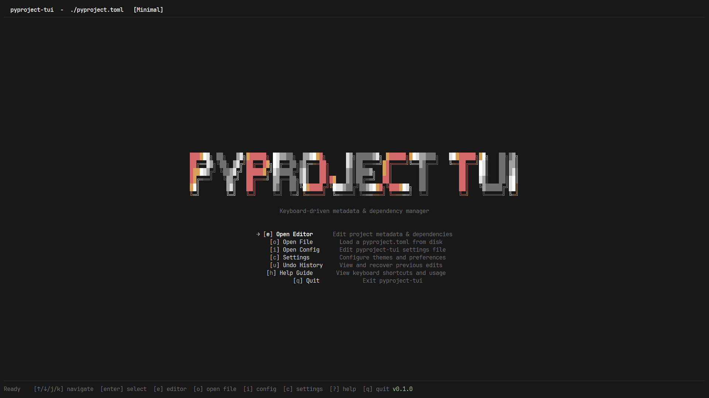

# pyproject-tui



A keyboard-driven terminal UI for reading and editing `pyproject.toml` files with live settings, persistent configuration, and semantic theming.

[](https://goreportcard.com/report/github.com/programmersd21/pyproject-tui)
[](https://github.com/programmersd21/pyproject-tui/actions/workflows/ci.yml)
[](https://github.com/programmersd21/pyproject-tui/releases)
[](./LICENSE)

## Features

- **Parse and render** any valid `pyproject.toml`
- **Two-pane layout** with section navigation and field editing
- **Inline editing** with Bubble Tea text inputs
- **Focus system** - `Tab`/`Shift+Tab` switches between sidebar and editor. Active pane is colorful, inactive pane dims to gray. Footer shows which pane is active.
- **Sandfall reveal animation** - tiny `·` grains fall from the top in a wavy stream, settle into the PYPROJECT TUI logo, then transition to a smooth sine-wave gradient using the current theme's colors. Plays once on launch and restarts when the theme changes.
- **Open any file** from the dashboard with a path prompt (`o`)
- **Open config directly** to edit pyproject-tui settings in-app (`i`)
- **Add new tool sections** - press `a` in the sidebar to create `[tool.*]` sections
- **Save changes** back to disk with preserved unknown sections
- **Dirty-state tracking** and **undo/redo** (up to 50 edits) with visual count
- **10 premium themes** including Tokyo Night, Catppuccin, Nord, Gruvbox, Rose Pine, Everforest, Python
- **Settings page** with compact layout, Unicode section icons, rounded border, and live theme preview
- **Dashboard** with labeled menu shortcuts and sandfall animation
- **Native file open** - config opens in your OS default editor
- **Responsive layout** that adapts to terminal size
- **App version** displayed in green in the footer
- **Comprehensive help** overlay with categorized keybindings
- **Cross-platform** Makefile for Windows, Linux, and macOS

## Installation

### AUR install

```sh
yay -S pyproject-tui-bin
```

Lots of thanks to [@Dominiquini](https://github.com/Dominiquini) for assistance in AUR deployment!

### Go install

```sh
go install github.com/programmersd21/pyproject-tui/cmd/pyproject-tui@latest
```

### Binary download

Download the latest release from the GitHub Releases page for your platform.

## Usage

```sh
pyproject-tui                    # opens ./pyproject.toml
pyproject-tui path/to/my.toml   # opens a specific file
pyproject-tui --create          # creates pyproject.toml if missing
pyproject-tui --version         # prints version
```

## Keybindings

### Dashboard

| Key | Action |
|---|---|
| `↑/↓` or `j/k` | Navigate menu |
| `Enter` | Select menu item |
| `e` | Open editor |
| `o` | Open file prompt |
| `i` | Open config in default OS editor |
| `c` | Open settings |
| `t` | Cycle theme |
| `u` | Show undo history |
| `?` / `h` | Toggle help |
| `q` / `Ctrl+C` | Quit |

### Editor

| Key | Action |
|---|---|
| `Tab` / `Shift+Tab` | Switch focus between sidebar and editor |
| `h` / `←` | Move focus to sidebar |
| `l` / `→` | Move focus to editor |
| `j` / `↓` | Move down |
| `k` / `↑` | Move up |
| `e` / `Enter` | Edit selected field or open section |
| `a` | Add new field (editor) or tool section (sidebar) |
| `d` | Delete field or section |
| `s` | Save changes to disk |
| `u` | Undo last change (up to 50 edits) |
| `r` | Redo last undone change |
| `t` | Cycle theme |
| `c` | Open settings |
| `?` | Toggle help |
| `Esc` | Return to dashboard |
| `q` / `Ctrl+C` | Quit |

The editor footer displays the active pane name ("Sidebar" or "Editor") in accent color at the left, followed by keyhints, and the app version in green at the right edge of the status bar.

### Settings

| Key | Action |
|---|---|
| `↑/↓` or `j/k` | Navigate options |
| `Enter` / `Space` / `→` | Change value |
| `s` | Save and exit |
| `Esc` | Back to dashboard |

## Themes

pyproject-tui includes 10 carefully crafted themes:

- **Tokyo Night** - Popular dark theme with vibrant blues
- **Catppuccin** - Soothing pastel color palette
- **Nord** - Arctic-inspired color scheme
- **Gruvbox** - Retro groove color scheme
- **Rose Pine** - Minimal, natural color palette
- **Everforest** - Comfortable green forest theme
- **Python** - Blue-and-gold palette inspired by the Python ecosystem
- **Midnight** - Deep blue night theme
- **Minimal** - Clean monochrome aesthetic
- **Sage** - Earthy green tones

Switch themes with `t` or configure in settings (`c`).

## Configuration

Settings are stored in the OS config directory and apply immediately at runtime:

- Linux: `~/.config/pyproject-tui/config.toml`
- macOS: `~/Library/Application Support/pyproject-tui/config.toml`
- Windows: `%AppData%\pyproject-tui\config.toml`

You can open the config file directly from the dashboard with `i`.

Example configuration:

```toml
theme = "tokyo-night"
animations = true
ui_density = "normal"
border_style = "rounded"
show_line_numbers = false
```

### Options

- `theme`: One of the 10 available themes
- `animations`: Enable/disable animations (`true`/`false`)
- `ui_density`: Layout density (`"compact"`, `"normal"`, `"comfortable"`)
- `border_style`: Border appearance (`"rounded"`, `"normal"`, `"thick"`, `"double"`)
- `show_line_numbers`: Show line numbers in the editor

Changing a setting updates the application immediately and persists to disk so the next launch restores the same state.

## Supported Sections

| Section | Support |
|---|---|
| `[project]` | Typed fields, maps, arrays, nested tables |
| `[build-system]` | Typed fields |
| `[tool.*]` | Generic recursive tree rendering |

## Building

```sh
make build      # build binary to dist/
make test       # run tests with race detector
make lint       # run golangci-lint
make fmt        # format code
make clean      # remove build artifacts
make check      # run all checks (fmt, vet, lint, test)
```

## Architecture

```
internal/
  model/        # Bubble Tea models (app, sidebar, editor, settings)
  parser/       # TOML parsing and serialization
  settings/     # Configuration management
  theme/        # Semantic theme engine and presets
  ui/           # Layout helpers and style utilities
```

## Contributing

See [CONTRIBUTING.md](./CONTRIBUTING.md).

## License

MIT License - see [LICENSE](./LICENSE) for details.
